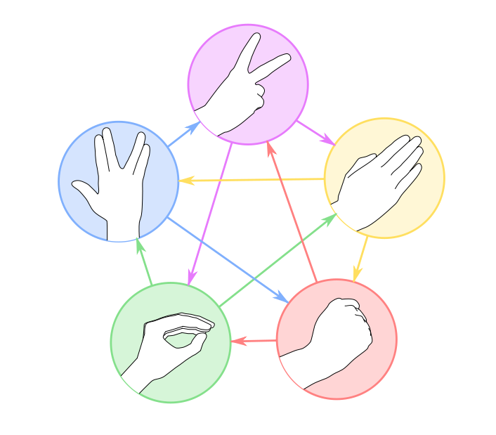

# Rock-Paper-Scissors-Lizard-Spock Game
This is a collaborative project that demonstrates Python expertese in implementation of Rock-Paper-Scissors-Lizard-Spock game, featuring unpredictable outcomes with random libraries and a dynamic 2-player mode.


Game has 2 modes and the user can decide if they want to play against another player or computer.
## How to Play
1. Run the script
2. Enter your choice: 'r' for rock, 'p' for paper, 's' for scissors, 'l' for lizard, or 'sp' for spock.
3. The computer will randomly choose its move.
4. The winner will be determined based on the game rules.
   
## Game Rules
* Rock 👊 crushes scissors and lizard.
* Scissors ✌️ cut paper and decapitate lizard.
* Paper ✋ covers rock and smothers Spock.
* Lizard 🤏 poisons Spock and eats paper.
* Spock 🖖 smashes scissors and vaporizes rock.




## Additional Features
-The game explains your and the computer's choices.
-Option to play another round after the game ends.

## Contributors
This project has been developed in collaboration with @AlexandreCorcos.

## Disclaimer and Additional improvements
We created this project as a part of our learning journey and may be further extending its functionality.
We are considering the expansion of its functionalities in future updates.

## Proposed Enhancements:
- **Secure User Input**: Implement hashing for user inputs in the 2-player mode to enhance security and privacy.
- **User Interface Enhancement**: Develop a more interactive user interface, potentially utilizing PyGame or similar frameworks, to improve user engagement and experience.
- **Networked Multiplayer Capability**: Incorporate socket programming to enable real-time, remote gameplay between users on different devices, enriching the game's accessibility and reach.
- **Dynamic Difficulty Levels**: Introduce difficulty levels for playing against the computer, adjusting the AI's predictability and strategy based on the selected difficulty.

Your contributions, suggestions, and feedback are welcome as we strive to improve and expand the functionality of this game.

Feel free to customize and extend the code as needed for your specific use case.
``` javascript

Replace `your-username` with your actual GitHub username in the repository URL.

```
